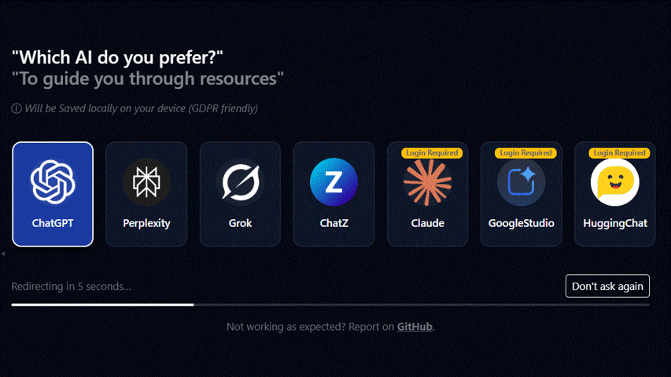
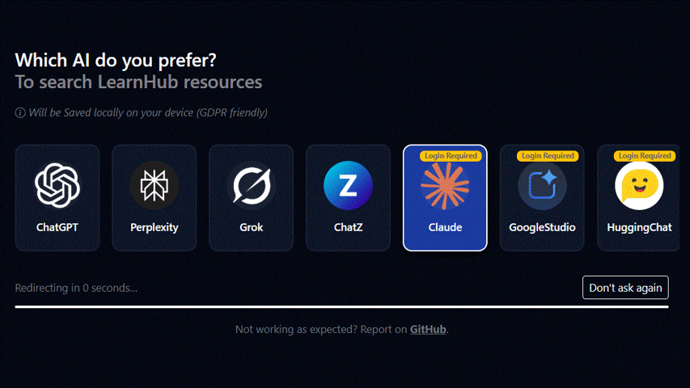
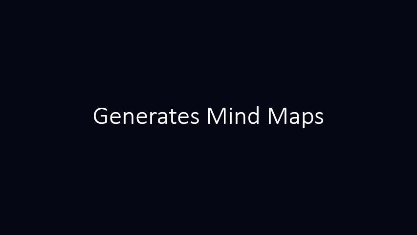

    
# LearnHub

## AI-Augmented Learning Partner (200+ Summaries)

> Learn and review tech topics efficiently using concise, high-quality summaries.

---

## 📚 Project docs

- 🧭 **[VISION.md](VISION.md)** – Why LearnHub exists, what it is (and is not), and the long-term dream.
- 🗺 **[ROADMAP.md](ROADMAP.md)** – What’s shipped, what’s in progress, and where the project is headed next.
- 🤖 **[AI_FEATURES.md](AI_FEATURES.md)** – How AI-powered flows, global entry points, per-summary buttons, and live examples.
- 🤝 **[CONTRIBUTING.md](CONTRIBUTING.md)** – How to request new topics, report issues, and improve docs / code.

If you are new here, read **VISION** first, then skim **AI_FEATURES**, and finally check the **ROADMAP** and **CONTRIBUTING**.

---

## 🤿 Let's Dive in!
Want your AI chatbot to create a personalized study plan for you using LearnHub resources? Click the link below!

[🍚 Ask AI to Cook Up My Rapid Study Plan](https://alisol.ir/?ai=learnhub_starter)

Other langs:

[🇳🇱 NL](https://alisol.ir/?ai=learnhub_starter|NL)  
[🇩🇪 DE](https://alisol.ir/?ai=learnhub_starter|DE)  
[🇫🇷 FR](https://alisol.ir/?ai=learnhub_starter|FR)  
[🇪🇸 ES](https://alisol.ir/?ai=learnhub_starter|ES)  
[🇮🇹 IT](https://alisol.ir/?ai=learnhub_starter|IT)  
[🇸🇪 SV](https://alisol.ir/?ai=learnhub_starter|SV)  
[🇩🇰 DA](https://alisol.ir/?ai=learnhub_starter|DA)  
[🇳🇴 NO](https://alisol.ir/?ai=learnhub_starter|NO)  
[🇵🇱 PL](https://alisol.ir/?ai=learnhub_starter|PL)  
[🇵🇹 PT](https://alisol.ir/?ai=learnhub_starter|PT)  
[🇷🇴 RO](https://alisol.ir/?ai=learnhub_starter|RO)  
[🇷🇺 RU](https://alisol.ir/?ai=learnhub_starter|RU)  
[🇮🇳 HI](https://alisol.ir/?ai=learnhub_starter|HI)  
[🇸🇦 AR](https://alisol.ir/?ai=learnhub_starter|AR)  
[🇮🇷 FA](https://alisol.ir/?ai=learnhub_starter|FA)  
[🇹🇷 TR](https://alisol.ir/?ai=learnhub_starter|TR)

### How it works:

    
  

## 🔍 AI-powered LearnHub search
Your AI chatbot can find desired resources through LearnHub.

[⚡️ Search LearnHub using AI](https://alisol.ir/?ai=learnhub_search)

Other langs:

[🇳🇱 NL](https://alisol.ir/?ai=learnhub_search|NL)  
[🇩🇪 DE](https://alisol.ir/?ai=learnhub_search|DE)  
[🇫🇷 FR](https://alisol.ir/?ai=learnhub_search|FR)  
[🇪🇸 ES](https://alisol.ir/?ai=learnhub_search|ES)  
[🇮🇹 IT](https://alisol.ir/?ai=learnhub_search|IT)  
[🇸🇪 SV](https://alisol.ir/?ai=learnhub_search|SV)  
[🇩🇰 DA](https://alisol.ir/?ai=learnhub_search|DA)  
[🇳🇴 NO](https://alisol.ir/?ai=learnhub_search|NO)  
[🇵🇱 PL](https://alisol.ir/?ai=learnhub_search|PL)  
[🇵🇹 PT](https://alisol.ir/?ai=learnhub_search|PT)  
[🇷🇴 RO](https://alisol.ir/?ai=learnhub_search|RO)  
[🇷🇺 RU](https://alisol.ir/?ai=learnhub_search|RU)  
[🇮🇳 HI](https://alisol.ir/?ai=learnhub_search|HI)  
[🇸🇦 AR](https://alisol.ir/?ai=learnhub_search|AR)  
[🇮🇷 FA](https://alisol.ir/?ai=learnhub_search|FA)  
[🇹🇷 TR](https://alisol.ir/?ai=learnhub_search|TR)

### How it works:

    
  

## 💪 Summary AI-Powered Buttons

### Try them directly:

[🧠 Mindmap - AWS Essential Training for Developers](https://alisol.ir/?ai=learnhub_summary_mindmap&src=courses/linkedin-aws-essential-training-for-developers)

Other langs:
( [NL](https://alisol.ir/?ai=learnhub_summary_mindmap&src=courses/linkedin-aws-essential-training-for-developers&lang=NL) | 
[DE](https://alisol.ir/?ai=learnhub_summary_mindmap&src=courses/linkedin-aws-essential-training-for-developers&lang=DE) | 
[FR](https://alisol.ir/?ai=learnhub_summary_mindmap&src=courses/linkedin-aws-essential-training-for-developers&lang=FR) | 
[ES](https://alisol.ir/?ai=learnhub_summary_mindmap&src=courses/linkedin-aws-essential-training-for-developers&lang=ES) | 
[IT](https://alisol.ir/?ai=learnhub_summary_mindmap&src=courses/linkedin-aws-essential-training-for-developers&lang=IT) | 
[SV](https://alisol.ir/?ai=learnhub_summary_mindmap&src=courses/linkedin-aws-essential-training-for-developers&lang=SV) | 
[DA](https://alisol.ir/?ai=learnhub_summary_mindmap&src=courses/linkedin-aws-essential-training-for-developers&lang=DA) | 
[NO](https://alisol.ir/?ai=learnhub_summary_mindmap&src=courses/linkedin-aws-essential-training-for-developers&lang=NO) | 
[PL](https://alisol.ir/?ai=learnhub_summary_mindmap&src=courses/linkedin-aws-essential-training-for-developers&lang=PL) | 
[PT](https://alisol.ir/?ai=learnhub_summary_mindmap&src=courses/linkedin-aws-essential-training-for-developers&lang=PT) | 
[RO](https://alisol.ir/?ai=learnhub_summary_mindmap&src=courses/linkedin-aws-essential-training-for-developers&lang=RO) | 
[RU](https://alisol.ir/?ai=learnhub_summary_mindmap&src=courses/linkedin-aws-essential-training-for-developers&lang=RU) | 
[HI](https://alisol.ir/?ai=learnhub_summary_mindmap&src=courses/linkedin-aws-essential-training-for-developers&lang=HI) | 
[AR](https://alisol.ir/?ai=learnhub_summary_mindmap&src=courses/linkedin-aws-essential-training-for-developers&lang=AR) | 
[FA](https://alisol.ir/?ai=learnhub_summary_mindmap&src=courses/linkedin-aws-essential-training-for-developers&lang=FA) | 
[TR](https://alisol.ir/?ai=learnhub_summary_mindmap&src=courses/linkedin-aws-essential-training-for-developers&lang=TR) )

---

[📇 Flashcards - System Design Distributed Message Queue (Kafka)](https://alisol.ir/?ai=learnhub_summary_flashcards&src=mock-interviews/system-design/Design%20Distributed%20Message%20Queue%20like%20Kafka)

Other langs:
( [NL](https://alisol.ir/?ai=learnhub_summary_flashcards&src=mock-interviews/system-design/Design%20Distributed%20Message%20Queue%20like%20Kafka&lang=NL) | 
[DE](https://alisol.ir/?ai=learnhub_summary_flashcards&src=mock-interviews/system-design/Design%20Distributed%20Message%20Queue%20like%20Kafka&lang=DE) | 
[FR](https://alisol.ir/?ai=learnhub_summary_flashcards&src=mock-interviews/system-design/Design%20Distributed%20Message%20Queue%20like%20Kafka&lang=FR) | 
[ES](https://alisol.ir/?ai=learnhub_summary_flashcards&src=mock-interviews/system-design/Design%20Distributed%20Message%20Queue%20like%20Kafka&lang=ES) | 
[IT](https://alisol.ir/?ai=learnhub_summary_flashcards&src=mock-interviews/system-design/Design%20Distributed%20Message%20Queue%20like%20Kafka&lang=IT) | 
[SV](https://alisol.ir/?ai=learnhub_summary_flashcards&src=mock-interviews/system-design/Design%20Distributed%20Message%20Queue%20like%20Kafka&lang=SV) | 
[DA](https://alisol.ir/?ai=learnhub_summary_flashcards&src=mock-interviews/system-design/Design%20Distributed%20Message%20Queue%20like%20Kafka&lang=DA) | 
[NO](https://alisol.ir/?ai=learnhub_summary_flashcards&src=mock-interviews/system-design/Design%20Distributed%20Message%20Queue%20like%20Kafka&lang=NO) | 
[PL](https://alisol.ir/?ai=learnhub_summary_flashcards&src=mock-interviews/system-design/Design%20Distributed%20Message%20Queue%20like%20Kafka&lang=PL) | 
[PT](https://alisol.ir/?ai=learnhub_summary_flashcards&src=mock-interviews/system-design/Design%20Distributed%20Message%20Queue%20like%20Kafka&lang=PT) | 
[RO](https://alisol.ir/?ai=learnhub_summary_flashcards&src=mock-interviews/system-design/Design%20Distributed%20Message%20Queue%20like%20Kafka&lang=RO) | 
[RU](https://alisol.ir/?ai=learnhub_summary_flashcards&src=mock-interviews/system-design/Design%20Distributed%20Message%20Queue%20like%20Kafka&lang=RU) | 
[HI](https://alisol.ir/?ai=learnhub_summary_flashcards&src=mock-interviews/system-design/Design%20Distributed%20Message%20Queue%20like%20Kafka&lang=HI) | 
[AR](https://alisol.ir/?ai=learnhub_summary_flashcards&src=mock-interviews/system-design/Design%20Distributed%20Message%20Queue%20like%20Kafka&lang=AR) | 
[FA](https://alisol.ir/?ai=learnhub_summary_flashcards&src=mock-interviews/system-design/Design%20Distributed%20Message%20Queue%20like%20Kafka&lang=FA) | 
[TR](https://alisol.ir/?ai=learnhub_summary_flashcards&src=mock-interviews/system-design/Design%20Distributed%20Message%20Queue%20like%20Kafka&lang=TR) )

---

[🧩 Alanogy - Code with Mosh Mastering Design Patterns Part 1](https://alisol.ir/?ai=learnhub_summary_analogy&src=courses/code-with-mosh-mastering-design-patterns-part-1)

Other langs:
( [NL](https://alisol.ir/?ai=learnhub_summary_analogy&src=courses/code-with-mosh-mastering-design-patterns-part-1&lang=NL) | 
[DE](https://alisol.ir/?ai=learnhub_summary_analogy&src=courses/code-with-mosh-mastering-design-patterns-part-1&lang=DE) | 
[FR](https://alisol.ir/?ai=learnhub_summary_analogy&src=courses/code-with-mosh-mastering-design-patterns-part-1&lang=FR) | 
[ES](https://alisol.ir/?ai=learnhub_summary_analogy&src=courses/code-with-mosh-mastering-design-patterns-part-1&lang=ES) | 
[IT](https://alisol.ir/?ai=learnhub_summary_analogy&src=courses/code-with-mosh-mastering-design-patterns-part-1&lang=IT) | 
[SV](https://alisol.ir/?ai=learnhub_summary_analogy&src=courses/code-with-mosh-mastering-design-patterns-part-1&lang=SV) | 
[DA](https://alisol.ir/?ai=learnhub_summary_analogy&src=courses/code-with-mosh-mastering-design-patterns-part-1&lang=DA) | 
[NO](https://alisol.ir/?ai=learnhub_summary_analogy&src=courses/code-with-mosh-mastering-design-patterns-part-1&lang=NO) | 
[PL](https://alisol.ir/?ai=learnhub_summary_analogy&src=courses/code-with-mosh-mastering-design-patterns-part-1&lang=PL) | 
[PT](https://alisol.ir/?ai=learnhub_summary_analogy&src=courses/code-with-mosh-mastering-design-patterns-part-1&lang=PT) | 
[RO](https://alisol.ir/?ai=learnhub_summary_analogy&src=courses/code-with-mosh-mastering-design-patterns-part-1&lang=RO) | 
[RU](https://alisol.ir/?ai=learnhub_summary_analogy&src=courses/code-with-mosh-mastering-design-patterns-part-1&lang=RU) | 
[HI](https://alisol.ir/?ai=learnhub_summary_analogy&src=courses/code-with-mosh-mastering-design-patterns-part-1&lang=HI) | 
[AR](https://alisol.ir/?ai=learnhub_summary_analogy&src=courses/code-with-mosh-mastering-design-patterns-part-1&lang=AR) | 
[FA](https://alisol.ir/?ai=learnhub_summary_analogy&src=courses/code-with-mosh-mastering-design-patterns-part-1&lang=FA) | 
[TR](https://alisol.ir/?ai=learnhub_summary_analogy&src=courses/code-with-mosh-mastering-design-patterns-part-1&lang=TR) )

---

[🎯 Advanced Teaching - Laravel Queue Mastery](https://alisol.ir/?ai=learnhub_summary_teach&level=advanced&src=courses/laracasts-laravel-queue-mastery)

Other langs:
( [NL](https://alisol.ir/?ai=learnhub_summary_teach&level=advanced&src=courses/laracasts-laravel-queue-mastery&lang=NL) | 
[DE](https://alisol.ir/?ai=learnhub_summary_teach&level=advanced&src=courses/laracasts-laravel-queue-mastery&lang=DE) | 
[FR](https://alisol.ir/?ai=learnhub_summary_teach&level=advanced&src=courses/laracasts-laravel-queue-mastery&lang=FR) | 
[ES](https://alisol.ir/?ai=learnhub_summary_teach&level=advanced&src=courses/laracasts-laravel-queue-mastery&lang=ES) | 
[IT](https://alisol.ir/?ai=learnhub_summary_teach&level=advanced&src=courses/laracasts-laravel-queue-mastery&lang=IT) | 
[SV](https://alisol.ir/?ai=learnhub_summary_teach&level=advanced&src=courses/laracasts-laravel-queue-mastery&lang=SV) | 
[DA](https://alisol.ir/?ai=learnhub_summary_teach&level=advanced&src=courses/laracasts-laravel-queue-mastery&lang=DA) | 
[NO](https://alisol.ir/?ai=learnhub_summary_teach&level=advanced&src=courses/laracasts-laravel-queue-mastery&lang=NO) | 
[PL](https://alisol.ir/?ai=learnhub_summary_teach&level=advanced&src=courses/laracasts-laravel-queue-mastery&lang=PL) | 
[PT](https://alisol.ir/?ai=learnhub_summary_teach&level=advanced&src=courses/laracasts-laravel-queue-mastery&lang=PT) | 
[RO](https://alisol.ir/?ai=learnhub_summary_teach&level=advanced&src=courses/laracasts-laravel-queue-mastery&lang=RO) | 
[RU](https://alisol.ir/?ai=learnhub_summary_teach&level=advanced&src=courses/laracasts-laravel-queue-mastery&lang=RU) | 
[HI](https://alisol.ir/?ai=learnhub_summary_teach&level=advanced&src=courses/laracasts-laravel-queue-mastery&lang=HI) | 
[AR](https://alisol.ir/?ai=learnhub_summary_teach&level=advanced&src=courses/laracasts-laravel-queue-mastery&lang=AR) | 
[FA](https://alisol.ir/?ai=learnhub_summary_teach&level=advanced&src=courses/laracasts-laravel-queue-mastery&lang=FA) | 
[TR](https://alisol.ir/?ai=learnhub_summary_teach&level=advanced&src=courses/laracasts-laravel-queue-mastery&lang=TR) )

---

[🤖 Ask AI Topic - Consistency and Consensus DDIA](https://alisol.ir/?ai=Consistency%20and%20Consensus%7CMartin%20Kleppmann%7CDesigning%20Data-Intensive%20Applications)

Other langs:
( [NL](https://alisol.ir/?ai=Consistency%20and%20Consensus%7CMartin%20Kleppmann%7CDesigning%20Data-Intensive%20Applications&lang=NL) | 
[DE](https://alisol.ir/?ai=Consistency%20and%20Consensus%7CMartin%20Kleppmann%7CDesigning%20Data-Intensive%20Applications&lang=DE) | 
[FR](https://alisol.ir/?ai=Consistency%20and%20Consensus%7CMartin%20Kleppmann%7CDesigning%20Data-Intensive%20Applications&lang=FR) | 
[ES](https://alisol.ir/?ai=Consistency%20and%20Consensus%7CMartin%20Kleppmann%7CDesigning%20Data-Intensive%20Applications&lang=ES) | 
[IT](https://alisol.ir/?ai=Consistency%20and%20Consensus%7CMartin%20Kleppmann%7CDesigning%20Data-Intensive%20Applications&lang=IT) | 
[SV](https://alisol.ir/?ai=Consistency%20and%20Consensus%7CMartin%20Kleppmann%7CDesigning%20Data-Intensive%20Applications&lang=SV) | 
[DA](https://alisol.ir/?ai=Consistency%20and%20Consensus%7CMartin%20Kleppmann%7CDesigning%20Data-Intensive%20Applications&lang=DA) | 
[NO](https://alisol.ir/?ai=Consistency%20and%20Consensus%7CMartin%20Kleppmann%7CDesigning%20Data-Intensive%20Applications&lang=NO) | 
[PL](https://alisol.ir/?ai=Consistency%20and%20Consensus%7CMartin%20Kleppmann%7CDesigning%20Data-Intensive%20Applications&lang=PL) | 
[PT](https://alisol.ir/?ai=Consistency%20and%20Consensus%7CMartin%20Kleppmann%7CDesigning%20Data-Intensive%20Applications&lang=PT) | 
[RO](https://alisol.ir/?ai=Consistency%20and%20Consensus%7CMartin%20Kleppmann%7CDesigning%20Data-Intensive%20Applications&lang=RO) | 
[RU](https://alisol.ir/?ai=Consistency%20and%20Consensus%7CMartin%20Kleppmann%7CDesigning%20Data-Intensive%20Applications&lang=RU) | 
[HI](https://alisol.ir/?ai=Consistency%20and%20Consensus%7CMartin%20Kleppmann%7CDesigning%20Data-Intensive%20Applications&lang=HI) | 
[AR](https://alisol.ir/?ai=Consistency%20and%20Consensus%7CMartin%20Kleppmann%7CDesigning%20Data-Intensive%20Applications&lang=AR) | 
[FA](https://alisol.ir/?ai=Consistency%20and%20Consensus%7CMartin%20Kleppmann%7CDesigning%20Data-Intensive%20Applications&lang=FA) | 
[TR](https://alisol.ir/?ai=Consistency%20and%20Consensus%7CMartin%20Kleppmann%7CDesigning%20Data-Intensive%20Applications&lang=TR) )

### How it works:

    
  

---

## Important disclaimer

This repository contains my personal notes and interpretations based on third-party resources
(such as online courses, YouTube videos, books, and mock interviews).

These summaries are:
- **Not official material**,
- **Not endorsed by the original creators**, and
- **Not intended to be a replacement** for the original courses, books, or videos.

All rights to the original source content remain with their respective creators. 

If you are the owner of a work and you are unhappy about the presence of a summary related to your material in this repository, 
please contact me at [alisolphp@gmail.com](mailto:alisolphp@gmail.com). 
I will review it and remove it if necessary as soon as possible.

---

## 💡 Why this repo exists (short version)

LearnHub is a curated collection of concise, high-signal summaries for courses, YouTube videos, books, and mock interviews.

It is designed to help you:

- learn faster,
- review smarter (for example before interviews),
- and use your favourite programming language and natural language when drilling into details with an AI assistant.

For the full story and philosophy, see **[VISION.md](VISION.md)**.

---

## 🧠 Using this repo with AI

You can combine these summaries with an AI assistant to:

- Ask follow-up questions about any section of a summary.
- Turn flashcards into interactive Q&A practice.
- Translate explanations into your preferred tone and natural language.
- See examples in the programming language you are most comfortable with.
- Get freshness notes after each explanation (useful for older books and videos).
- Simulate interview-style discussions using the mock interview summaries.
- Go deeper into the topic with advanced AI hints at the end.

Typical workflow:

1. Open a `summary.*.md` file for the topic you are studying.
2. Use the **AI buttons** at the top (teach / flashcards / quiz / projects / …), or:
3. Highlight a section and ask your AI assistant to go deeper, ask “why?”, or request code examples.

See **[AI_FEATURES.md](AI_FEATURES.md)** for detailed routes and prompts.

---

## 🧭 Contributing

This is an opinionated, curated project. Summaries are **not crowd-sourced** – they are maintained by the project owner (and maybe a small trusted core team later).

You can still help a lot by:

- requesting new topics / resources,
- reporting broken links or AI buttons,
- suggesting better prompts and workflows,
- improving docs, and
- sending small, focused code improvements.

Read **[CONTRIBUTING.md](CONTRIBUTING.md)** for:

- what kinds of contributions are welcome **right now**,
- what is out of scope (e.g. editing summaries),
- and how to open good issues / PRs.

---

## 🗺 Repository structure at a glance

<!-- REPO_TOC_START -->
Auto-generated overview of the repository structure:

- [Courses (14)](#courses)
  - [Algorithms & Data Structures (1)](#algorithms-data-structures)
  - [DevOps, Cloud & Infrastructure (5)](#devops-cloud-infrastructure)
  - [Go & Backend Engineering (2)](#go-backend-engineering)
  - [Laravel Ecosystem (3)](#laravel-ecosystem)
  - [Management & Soft Skills (1)](#management-soft-skills)
  - [PHP Ecosystem (Symfony, WordPress, Slim, Zend) (1)](#php-ecosystem-symfony-wordpress-slim-zend)
  - [Software Engineering Practices (1)](#software-engineering-practices)
- [Mock Interviews – System Design (14)](#mock-interviews--system-design)
  - [Core Infrastructure & Fundamentals (Cache, Auth, Rate Limiter) (1)](#core-infrastructure-fundamentals-cache-auth-rate-limiter)
  - [E-commerce & Delivery (Amazon, Uber, Food Delivery) (1)](#e-commerce-delivery-amazon-uber-food-delivery)
  - [Fintech & Payment Systems (Stripe, Wallet, Ledger) (2)](#fintech-payment-systems-stripe-wallet-ledger)
  - [Media Streaming & Content (YouTube, Netflix, CDN) (3)](#media-streaming-content-youtube-netflix-cdn)
  - [Search, Maps & Location Services (Google Search, Maps, Geo-hashing) (3)](#search-maps-location-services-google-search-maps-geo-hashing)
  - [Social Media & Messaging (Facebook, WhatsApp, TikTok) (4)](#social-media-messaging-facebook-whatsapp-tiktok)
- [YouTube Videos (84)](#youtube-videos)
  - [Algorithms & Data Structures (15)](#algorithms-data-structures)
  - [C# & .NET Ecosystem (3)](#c-net-ecosystem)
  - [Databases (SQL & NoSQL) (9)](#databases-sql-nosql)
  - [DevOps, Cloud & Infrastructure (2)](#devops-cloud-infrastructure)
  - [E-commerce & Delivery (Magento, Shopify) (4)](#e-commerce-delivery-magento-shopify)
  - [Fintech & Payment Systems (Stripe, Wallet, Ledger) (6)](#fintech-payment-systems-stripe-wallet-ledger)
  - [Go & Backend Engineering (3)](#go-backend-engineering)
  - [Java & Spring Boot Ecosystem (2)](#java-spring-boot-ecosystem)
  - [JavaScript & TypeScript Ecosystem (11)](#javascript-typescript-ecosystem)
  - [Laravel Ecosystem (10)](#laravel-ecosystem)
  - [MCP & AI Context Servers (10)](#mcp-ai-context-servers)
  - [Other YouTube Videos (1)](#other-youtube-videos)
  - [PHP Ecosystem (Symfony, WordPress, Slim, Zend) (1)](#php-ecosystem-symfony-wordpress-slim-zend)
  - [Python & AI/Data Science (2)](#python-ai-data-science)
  - [Rust Engineering (1)](#rust-engineering)
  - [Security & Auth (4)](#security-auth)
- [Books (15)](#books)
  - [Databases (SQL & NoSQL) (1)](#databases-sql-nosql)
  - [DevOps, Cloud & Infrastructure (2)](#devops-cloud-infrastructure)
  - [Management & Soft Skills (2)](#management-soft-skills)
  - [Other Books (5)](#other-books)
  - [Python & AI/Data Science (1)](#python-ai-data-science)
  - [Software Engineering Practices (4)](#software-engineering-practices)
<!-- REPO_TOC_END -->

## 📂 Repository structure

> The sections below are auto-generated and list all existing summaries.

### Courses
<!-- COURSES_START -->
<h4 id="algorithms-data-structures">Algorithms &amp; Data Structures</h4>

- [Udemy K6 Automate Performance Load Testing Of Api Microservices](courses%2Fudemy-k6-automate-performance-load-testing-of-api-microservices%2Fsummary.en.md) [ [EN](courses%2Fudemy-k6-automate-performance-load-testing-of-api-microservices%2Fsummary.en.md) | [FA](courses%2Fudemy-k6-automate-performance-load-testing-of-api-microservices%2Fsummary.fa.md) ]

<h4 id="devops-cloud-infrastructure">DevOps, Cloud &amp; Infrastructure</h4>

- [Linkedin Aws Essential Training For Developers](courses%2Flinkedin-aws-essential-training-for-developers%2Fsummary.en.md) [ [EN](courses%2Flinkedin-aws-essential-training-for-developers%2Fsummary.en.md) | [FA](courses%2Flinkedin-aws-essential-training-for-developers%2Fsummary.fa.md) ]

- [Linkedin Serverless Architecture](courses%2Flinkedin-serverless-architecture%2Fsummary.en.md) [ [EN](courses%2Flinkedin-serverless-architecture%2Fsummary.en.md) | [FA](courses%2Flinkedin-serverless-architecture%2Fsummary.fa.md) ]

- [Udemy Docker Bootcamp Conquer Docker With Real World Projects](courses%2Fudemy-docker-bootcamp-conquer-docker-with-real-world-projects%2Fsummary.en.md) [ [EN](courses%2Fudemy-docker-bootcamp-conquer-docker-with-real-world-projects%2Fsummary.en.md) | [FA](courses%2Fudemy-docker-bootcamp-conquer-docker-with-real-world-projects%2Fsummary.fa.md) ]

- [Udemy Google Cloud Platform Gcp Fundamentals For Beginners](courses%2Fudemy-google-cloud-platform-gcp-fundamentals-for-beginners%2Fsummary.en.md) [ [EN](courses%2Fudemy-google-cloud-platform-gcp-fundamentals-for-beginners%2Fsummary.en.md) | [FA](courses%2Fudemy-google-cloud-platform-gcp-fundamentals-for-beginners%2Fsummary.fa.md) ]

- [Udemy System Design In Microsoft Azure Cloud](courses%2Fudemy-system-design-in-microsoft-azure-cloud%2Fsummary.en.md) [ [EN](courses%2Fudemy-system-design-in-microsoft-azure-cloud%2Fsummary.en.md) | [FA](courses%2Fudemy-system-design-in-microsoft-azure-cloud%2Fsummary.fa.md) ]

<h4 id="go-backend-engineering">Go &amp; Backend Engineering</h4>

- [Udemy Golang Web Development Create Powerful Servers With Golang](courses%2Fudemy-golang-web-development-create-powerful-servers-with-golang%2Fsummary.en.md) [ [EN](courses%2Fudemy-golang-web-development-create-powerful-servers-with-golang%2Fsummary.en.md) | [FA](courses%2Fudemy-golang-web-development-create-powerful-servers-with-golang%2Fsummary.fa.md) ]

- [Udemy Learn How To Code Googles Go Golang Programming Language](courses%2Fudemy-learn-how-to-code-googles-go-golang-programming-language%2Fsummary.en.md) [ [EN](courses%2Fudemy-learn-how-to-code-googles-go-golang-programming-language%2Fsummary.en.md) | [FA](courses%2Fudemy-learn-how-to-code-googles-go-golang-programming-language%2Fsummary.fa.md) ]

<h4 id="laravel-ecosystem">Laravel Ecosystem</h4>

- [Laracasts Graphql With Laravel And Vue](courses%2Flaracasts-graphql-with-laravel-and-vue%2Fsummary.en.md) [ [EN](courses%2Flaracasts-graphql-with-laravel-and-vue%2Fsummary.en.md) | [FA](courses%2Flaracasts-graphql-with-laravel-and-vue%2Fsummary.fa.md) ]

- [Laracasts Laravel Queue Mastery](courses%2Flaracasts-laravel-queue-mastery%2Fsummary.en.md) [ [EN](courses%2Flaracasts-laravel-queue-mastery%2Fsummary.en.md) | [FA](courses%2Flaracasts-laravel-queue-mastery%2Fsummary.fa.md) ]

- [Laracasts Learn Laravel Horizon](courses%2Flaracasts-learn-laravel-horizon%2Fsummary.en.md) [ [EN](courses%2Flaracasts-learn-laravel-horizon%2Fsummary.en.md) | [FA](courses%2Flaracasts-learn-laravel-horizon%2Fsummary.fa.md) ]

<h4 id="management-soft-skills">Management &amp; Soft Skills</h4>

- [Udemy English For Software Engineers Speak Like A Pro](courses%2Fudemy-english-for-software-engineers-speak-like-a-pro%2Fsummary.en.md) [ [EN](courses%2Fudemy-english-for-software-engineers-speak-like-a-pro%2Fsummary.en.md) | [FA](courses%2Fudemy-english-for-software-engineers-speak-like-a-pro%2Fsummary.fa.md) ]

<h4 id="php-ecosystem-symfony-wordpress-slim-zend">PHP Ecosystem (Symfony, WordPress, Slim, Zend)</h4>

- [Udemy Microservices Clean Architecture Ddd Saga Outbox Kafka](courses%2Fudemy-microservices-clean-architecture-ddd-saga-outbox-kafka%2Fsummary.en.md) [ [EN](courses%2Fudemy-microservices-clean-architecture-ddd-saga-outbox-kafka%2Fsummary.en.md) | [FA](courses%2Fudemy-microservices-clean-architecture-ddd-saga-outbox-kafka%2Fsummary.fa.md) ]

<h4 id="software-engineering-practices">Software Engineering Practices</h4>

- [Udemy Mastering Unit And Integration Testing In Clean Architecture](courses%2Fudemy-mastering-unit-and-integration-testing-in-clean-architecture%2Fsummary.en.md) [ [EN](courses%2Fudemy-mastering-unit-and-integration-testing-in-clean-architecture%2Fsummary.en.md) | [FA](courses%2Fudemy-mastering-unit-and-integration-testing-in-clean-architecture%2Fsummary.fa.md) ]
<!-- COURSES_END -->

### Mock Interviews – System Design
<!-- SYSTEM_DESIGN_START -->
<h4 id="core-infrastructure-fundamentals-cache-auth-rate-limiter">Core Infrastructure &amp; Fundamentals (Cache, Auth, Rate Limiter)</h4>

- [Design Notification Service System | Handle Billions Of Users & Notifications](mock-interviews%2Fsystem-design%2FDesign%20Notification%20Service%20System%20%7C%20Handle%20Billions%20of%20users%20%26%20Notifications%2Fsummary.en.md) [ [EN](mock-interviews%2Fsystem-design%2FDesign%20Notification%20Service%20System%20%7C%20Handle%20Billions%20of%20users%20%26%20Notifications%2Fsummary.en.md) | [FA](mock-interviews%2Fsystem-design%2FDesign%20Notification%20Service%20System%20%7C%20Handle%20Billions%20of%20users%20%26%20Notifications%2Fsummary.fa.md) ]

<h4 id="e-commerce-delivery-amazon-uber-food-delivery">E-commerce &amp; Delivery (Amazon, Uber, Food Delivery)</h4>

- [Design Flight Booking System | Airline Reservation System | Distributed Transactions, Serialisation, Linearisation, Consistency](mock-interviews%2Fsystem-design%2FDesign%20Flight%20Booking%20System%20%7C%20Airline%20Reservation%20System%20%7C%20Distributed%20Transactions%2C%20Serialisation%2C%20Linearisation%2C%20Consistency%2Fsummary.en.md) [ [EN](mock-interviews%2Fsystem-design%2FDesign%20Flight%20Booking%20System%20%7C%20Airline%20Reservation%20System%20%7C%20Distributed%20Transactions%2C%20Serialisation%2C%20Linearisation%2C%20Consistency%2Fsummary.en.md) | [FA](mock-interviews%2Fsystem-design%2FDesign%20Flight%20Booking%20System%20%7C%20Airline%20Reservation%20System%20%7C%20Distributed%20Transactions%2C%20Serialisation%2C%20Linearisation%2C%20Consistency%2Fsummary.fa.md) ]

<h4 id="fintech-payment-systems-stripe-wallet-ledger">Fintech &amp; Payment Systems (Stripe, Wallet, Ledger)</h4>

- [Design A Digital Wallet (3+ Approaches) | Google Interview Question](mock-interviews%2Fsystem-design%2FDesign%20a%20Digital%20Wallet%20%283%2B%20Approaches%29%20%7C%20Google%20Interview%20Question%2Fsummary.en.md) [ [EN](mock-interviews%2Fsystem-design%2FDesign%20a%20Digital%20Wallet%20%283%2B%20Approaches%29%20%7C%20Google%20Interview%20Question%2Fsummary.en.md) | [FA](mock-interviews%2Fsystem-design%2FDesign%20a%20Digital%20Wallet%20%283%2B%20Approaches%29%20%7C%20Google%20Interview%20Question%2Fsummary.fa.md) ]

- [Design Payment System](mock-interviews%2Fsystem-design%2FDesign%20Payment%20System%2Fsummary.en.md) [ [EN](mock-interviews%2Fsystem-design%2FDesign%20Payment%20System%2Fsummary.en.md) | [FA](mock-interviews%2Fsystem-design%2FDesign%20Payment%20System%2Fsummary.fa.md) ]

<h4 id="media-streaming-content-youtube-netflix-cdn">Media Streaming &amp; Content (YouTube, Netflix, CDN)</h4>

- [Design Content Delivery Network | CDN](mock-interviews%2Fsystem-design%2FDesign%20Content%20Delivery%20Network%20%7C%20CDN%2Fsummary.en.md) [ [EN](mock-interviews%2Fsystem-design%2FDesign%20Content%20Delivery%20Network%20%7C%20CDN%2Fsummary.en.md) | [FA](mock-interviews%2Fsystem-design%2FDesign%20Content%20Delivery%20Network%20%7C%20CDN%2Fsummary.fa.md) ]

- [Design Netflix System](mock-interviews%2Fsystem-design%2FDesign%20Netflix%20System%2Fsummary.en.md) [ [EN](mock-interviews%2Fsystem-design%2FDesign%20Netflix%20System%2Fsummary.en.md) | [FA](mock-interviews%2Fsystem-design%2FDesign%20Netflix%20System%2Fsummary.fa.md) ]

- [Design Spotify | Ex Google EM | Google System Design Interview](mock-interviews%2Fsystem-design%2FDesign%20Spotify%20%7C%20ex-Google%20EM%20%7C%20Google%20System%20Design%20Interview%2Fsummary.en.md) [ [EN](mock-interviews%2Fsystem-design%2FDesign%20Spotify%20%7C%20ex-Google%20EM%20%7C%20Google%20System%20Design%20Interview%2Fsummary.en.md) | [FA](mock-interviews%2Fsystem-design%2FDesign%20Spotify%20%7C%20ex-Google%20EM%20%7C%20Google%20System%20Design%20Interview%2Fsummary.fa.md) ]

<h4 id="search-maps-location-services-google-search-maps-geo-hashing">Search, Maps &amp; Location Services (Google Search, Maps, Geo-hashing)</h4>

- [Design Autocomplete For Search Engines | Typeahead Suggestions For Google Search](mock-interviews%2Fsystem-design%2FDesign%20Autocomplete%20for%20Search%20Engines%20%7C%20Typeahead%20Suggestions%20for%20Google%20search%2Fsummary.en.md) [ [EN](mock-interviews%2Fsystem-design%2FDesign%20Autocomplete%20for%20Search%20Engines%20%7C%20Typeahead%20Suggestions%20for%20Google%20search%2Fsummary.en.md) | [FA](mock-interviews%2Fsystem-design%2FDesign%20Autocomplete%20for%20Search%20Engines%20%7C%20Typeahead%20Suggestions%20for%20Google%20search%2Fsummary.fa.md) ]

- [Design Google Maps System](mock-interviews%2Fsystem-design%2FDesign%20Google%20Maps%20System%2Fsummary.en.md) [ [EN](mock-interviews%2Fsystem-design%2FDesign%20Google%20Maps%20System%2Fsummary.en.md) | [FA](mock-interviews%2Fsystem-design%2FDesign%20Google%20Maps%20System%2Fsummary.fa.md) ]

- [Design Google Search | How Google Searches One Document Among Billions Of Documents Quickly](mock-interviews%2Fsystem-design%2FDesign%20Google%20Search%20%7C%20How%20Google%20searches%20one%20document%20among%20Billions%20of%20documents%20quickly%2Fsummary.en.md) [ [EN](mock-interviews%2Fsystem-design%2FDesign%20Google%20Search%20%7C%20How%20Google%20searches%20one%20document%20among%20Billions%20of%20documents%20quickly%2Fsummary.en.md) | [FA](mock-interviews%2Fsystem-design%2FDesign%20Google%20Search%20%7C%20How%20Google%20searches%20one%20document%20among%20Billions%20of%20documents%20quickly%2Fsummary.fa.md) ]

<h4 id="social-media-messaging-facebook-whatsapp-tiktok">Social Media &amp; Messaging (Facebook, WhatsApp, TikTok)</h4>

- [Design Facebook | Design Instagram](mock-interviews%2Fsystem-design%2FDesign%20Facebook%20%7C%20Design%20Instagram%2Fsummary.en.md) [ [EN](mock-interviews%2Fsystem-design%2FDesign%20Facebook%20%7C%20Design%20Instagram%2Fsummary.en.md) | [FA](mock-interviews%2Fsystem-design%2FDesign%20Facebook%20%7C%20Design%20Instagram%2Fsummary.fa.md) ]

- [Design Instagram](mock-interviews%2Fsystem-design%2FDesign%20Instagram%2Fsummary.en.md) [ [EN](mock-interviews%2Fsystem-design%2FDesign%20Instagram%2Fsummary.en.md) | [FA](mock-interviews%2Fsystem-design%2FDesign%20Instagram%2Fsummary.fa.md) ]

- [Design TikTok | Ft. Google TPM](mock-interviews%2Fsystem-design%2FDesign%20TikTok%20%7C%20ft.%20Google%20TPM%2Fsummary.en.md) [ [EN](mock-interviews%2Fsystem-design%2FDesign%20TikTok%20%7C%20ft.%20Google%20TPM%2Fsummary.en.md) | [FA](mock-interviews%2Fsystem-design%2FDesign%20TikTok%20%7C%20ft.%20Google%20TPM%2Fsummary.fa.md) ]

- [Design WhatsApp | Chat Messaging Systems](mock-interviews%2Fsystem-design%2FDesign%20WhatsApp%20%7C%20Chat%20Messaging%20Systems%2Fsummary.en.md) [ [EN](mock-interviews%2Fsystem-design%2FDesign%20WhatsApp%20%7C%20Chat%20Messaging%20Systems%2Fsummary.en.md) | [FA](mock-interviews%2Fsystem-design%2FDesign%20WhatsApp%20%7C%20Chat%20Messaging%20Systems%2Fsummary.fa.md) ]
<!-- SYSTEM_DESIGN_END -->

### YouTube Videos
<!-- YOUTUBE_VIDEOS_START -->
<h4 id="algorithms-data-structures">Algorithms &amp; Data Structures</h4>

- [6 GRAPH PROBLEMS SOLVED | LeetCode Grind 2023 | Blind 75 List](youtube-videos%2F6%20GRAPH%20PROBLEMS%20SOLVED%20%7C%20LeetCode%20Grind%202023%20%7C%20Blind%2075%20List%2Fsummary.en.md) [ [EN](youtube-videos%2F6%20GRAPH%20PROBLEMS%20SOLVED%20%7C%20LeetCode%20Grind%202023%20%7C%20Blind%2075%20List%2Fsummary.en.md) ]

- [Alien Dictionary   Topological Sort   Leetcode 269](youtube-videos%2FAlien%20Dictionary%20-%20Topological%20Sort%20-%20Leetcode%20269%2Fsummary.en.md) [ [EN](youtube-videos%2FAlien%20Dictionary%20-%20Topological%20Sort%20-%20Leetcode%20269%2Fsummary.en.md) ]

- [Course Schedule II   Topological Sort   Leetcode 210](youtube-videos%2FCourse%20Schedule%20II%20-%20Topological%20Sort%20-%20Leetcode%20210%2Fsummary.en.md) [ [EN](youtube-videos%2FCourse%20Schedule%20II%20-%20Topological%20Sort%20-%20Leetcode%20210%2Fsummary.en.md) ]

- [K Closest Points To Origin   Heap | Priority Queue   Leetcode 973](youtube-videos%2FK%20Closest%20Points%20to%20Origin%20-%20Heap%20%7C%20Priority%20Queue%20-%20Leetcode%20973%2Fsummary.en.md) [ [EN](youtube-videos%2FK%20Closest%20Points%20to%20Origin%20-%20Heap%20%7C%20Priority%20Queue%20-%20Leetcode%20973%2Fsummary.en.md) ]

- [Kth Largest Element In An Array   Leetcode 215   Heaps](youtube-videos%2FKth%20Largest%20Element%20in%20an%20Array%20-%20Leetcode%20215%20-%20Heaps%2Fsummary.en.md) [ [EN](youtube-videos%2FKth%20Largest%20Element%20in%20an%20Array%20-%20Leetcode%20215%20-%20Heaps%2Fsummary.en.md) ]

- [Longest Substring Without Repeating Characters   Leetcode 3](youtube-videos%2FLongest%20Substring%20Without%20Repeating%20Characters%20-%20Leetcode%203%2Fsummary.en.md) [ [EN](youtube-videos%2FLongest%20Substring%20Without%20Repeating%20Characters%20-%20Leetcode%203%2Fsummary.en.md) ]

- [Lowest Common Ancestor Of A Binary Search Tree   Leetcode 235](youtube-videos%2FLowest%20Common%20Ancestor%20of%20a%20Binary%20Search%20Tree%20-%20Leetcode%20235%2Fsummary.en.md) [ [EN](youtube-videos%2FLowest%20Common%20Ancestor%20of%20a%20Binary%20Search%20Tree%20-%20Leetcode%20235%2Fsummary.en.md) ]

- [Max Consecutive Ones III   Leetcode 1004   Sliding Window](youtube-videos%2FMax%20Consecutive%20Ones%20III%20-%20Leetcode%201004%20-%20Sliding%20Window%2Fsummary.en.md) [ [EN](youtube-videos%2FMax%20Consecutive%20Ones%20III%20-%20Leetcode%201004%20-%20Sliding%20Window%2Fsummary.en.md) ]

- [Network Delay Time   Dijkstra's Algorithm   Leetcode 743](youtube-videos%2FNetwork%20Delay%20Time%20-%20Dijkstra%27s%20algorithm%20-%20Leetcode%20743%2Fsummary.en.md) [ [EN](youtube-videos%2FNetwork%20Delay%20Time%20-%20Dijkstra%27s%20algorithm%20-%20Leetcode%20743%2Fsummary.en.md) ]

- [Range Sum Query 2D   Immutable   Leetcode 304](youtube-videos%2FRange%20Sum%20Query%202D%20-%20Immutable%20-%20Leetcode%20304%2Fsummary.en.md) [ [EN](youtube-videos%2FRange%20Sum%20Query%202D%20-%20Immutable%20-%20Leetcode%20304%2Fsummary.en.md) ]

- [Shortest Path In A Binary Matrix   Leetcode 1091](youtube-videos%2FShortest%20Path%20in%20a%20Binary%20Matrix%20-%20Leetcode%201091%2Fsummary.en.md) [ [EN](youtube-videos%2FShortest%20Path%20in%20a%20Binary%20Matrix%20-%20Leetcode%201091%2Fsummary.en.md) ]

- [Shortest Path With Alternating Colors   Leetcode 1129](youtube-videos%2FShortest%20Path%20with%20Alternating%20Colors%20-%20Leetcode%201129%2Fsummary.en.md) [ [EN](youtube-videos%2FShortest%20Path%20with%20Alternating%20Colors%20-%20Leetcode%201129%2Fsummary.en.md) ]

- [Solving The Sliding Window Problems From Blind 75 | LeetCode](youtube-videos%2FSolving%20the%20Sliding%20Window%20Problems%20from%20Blind%2075%20%7C%20LeetCode%2Fsummary.en.md) [ [EN](youtube-videos%2FSolving%20the%20Sliding%20Window%20Problems%20from%20Blind%2075%20%7C%20LeetCode%2Fsummary.en.md) ]

- [Subarray Sum Equals K   Prefix Sums   Leetcode 560](youtube-videos%2FSubarray%20Sum%20Equals%20K%20-%20Prefix%20Sums%20-%20Leetcode%20560%2Fsummary.en.md) [ [EN](youtube-videos%2FSubarray%20Sum%20Equals%20K%20-%20Prefix%20Sums%20-%20Leetcode%20560%2Fsummary.en.md) ]

- [Sum Of Prefix Scores Of Strings   Leetcode 2416](youtube-videos%2FSum%20of%20Prefix%20Scores%20of%20Strings%20-%20Leetcode%202416%2Fsummary.en.md) [ [EN](youtube-videos%2FSum%20of%20Prefix%20Scores%20of%20Strings%20-%20Leetcode%202416%2Fsummary.en.md) ]

<h4 id="c-net-ecosystem">C# &amp; .NET Ecosystem</h4>

- [.NET 8 Crash Course | Learn Dotnet, C#, Entity Framework](youtube-videos%2F.NET%208%20Crash%20Course%20%7C%20Learn%20Dotnet%2C%20C%23%2C%20Entity%20Framework%2Fsummary.en.md) [ [EN](youtube-videos%2F.NET%208%20Crash%20Course%20%7C%20Learn%20Dotnet%2C%20C%23%2C%20Entity%20Framework%2Fsummary.en.md) ]

- [Learn ASP.NET Core 8.0   Full Course For Beginners [Tutorial]](youtube-videos%2FLearn%20ASP.NET%20Core%208.0%20-%20Full%20Course%20for%20Beginners%20%5BTutorial%5D%2Fsummary.en.md) [ [EN](youtube-videos%2FLearn%20ASP.NET%20Core%208.0%20-%20Full%20Course%20for%20Beginners%20%5BTutorial%5D%2Fsummary.en.md) ]

- [Learn C# FREE Tutorial Course Beginner To Advanced!](youtube-videos%2FLearn%20C%23%20FREE%20Tutorial%20Course%20Beginner%20to%20Advanced%21%2Fsummary.en.md) [ [EN](youtube-videos%2FLearn%20C%23%20FREE%20Tutorial%20Course%20Beginner%20to%20Advanced%21%2Fsummary.en.md) ]

<h4 id="databases-sql-nosql">Databases (SQL &amp; NoSQL)</h4>

- [Apache Cassandra Database – Full Course For Beginners](youtube-videos%2FApache%20Cassandra%20Database%20%E2%80%93%20Full%20Course%20for%20Beginners%2Fsummary.en.md) [ [EN](youtube-videos%2FApache%20Cassandra%20Database%20%E2%80%93%20Full%20Course%20for%20Beginners%2Fsummary.en.md) ]

- [Elasticsearch Course For Beginners](youtube-videos%2FElasticsearch%20Course%20for%20Beginners%2Fsummary.en.md) [ [EN](youtube-videos%2FElasticsearch%20Course%20for%20Beginners%2Fsummary.en.md) ]

- [Elasticsearch Query DSL In Details With Real Time Project Scenario](youtube-videos%2FElasticsearch%20Query%20DSL%20in%20details%20with%20real%20time%20project%20scenario%2Fsummary.en.md) [ [EN](youtube-videos%2FElasticsearch%20Query%20DSL%20in%20details%20with%20real%20time%20project%20scenario%2Fsummary.en.md) ]

- [Introduction To Apache Cassandra](youtube-videos%2FIntroduction%20to%20Apache%20Cassandra%2Fsummary.en.md) [ [EN](youtube-videos%2FIntroduction%20to%20Apache%20Cassandra%2Fsummary.en.md) ]

- [Master MONGODB In ONE VIDEO: Beginner To Advanced](youtube-videos%2FMaster%20MONGODB%20in%20ONE%20VIDEO%3A%20Beginner%20to%20Advanced%2Fsummary.en.md) [ [EN](youtube-videos%2FMaster%20MONGODB%20in%20ONE%20VIDEO%3A%20Beginner%20to%20Advanced%2Fsummary.en.md) ]

- [MongoDB Complete Course Tutorial](youtube-videos%2FMongoDB%20Complete%20Course%20Tutorial%2Fsummary.en.md) [ [EN](youtube-videos%2FMongoDB%20Complete%20Course%20Tutorial%2Fsummary.en.md) ]

- [MongoDB Tutorial In 1 Hour (2024)](youtube-videos%2FMongoDB%20Tutorial%20in%201%20Hour%20%282024%29%2Fsummary.en.md) [ [EN](youtube-videos%2FMongoDB%20Tutorial%20in%201%20Hour%20%282024%29%2Fsummary.en.md) ]

- [PostgreSQL Tutorial Full Course 2022](youtube-videos%2FPostgreSQL%20Tutorial%20Full%20Course%202022%2Fsummary.en.md) [ [EN](youtube-videos%2FPostgreSQL%20Tutorial%20Full%20Course%202022%2Fsummary.en.md) ]

- [Redis Crash Course](youtube-videos%2FRedis%20Crash%20Course%2Fsummary.en.md) [ [EN](youtube-videos%2FRedis%20Crash%20Course%2Fsummary.en.md) ]

<h4 id="devops-cloud-infrastructure">DevOps, Cloud &amp; Infrastructure</h4>

- [How To Install MinIO With N8n Locally | Full Step By Step Guide](youtube-videos%2FHow%20to%20Install%20MinIO%20with%20n8n%20Locally%20%7C%20Full%20Step-By-Step%20Guide%2Fsummary.en.md) [ [EN](youtube-videos%2FHow%20to%20Install%20MinIO%20with%20n8n%20Locally%20%7C%20Full%20Step-By-Step%20Guide%2Fsummary.en.md) ]

- [MinIO + HAProxy: My S3 Compatible Storage Solution](youtube-videos%2FMinIO%20%2B%20HAProxy%3A%20My%20S3-Compatible%20Storage%20Solution%2Fsummary.en.md) [ [EN](youtube-videos%2FMinIO%20%2B%20HAProxy%3A%20My%20S3-Compatible%20Storage%20Solution%2Fsummary.en.md) ]

<h4 id="e-commerce-delivery-magento-shopify">E-commerce &amp; Delivery (Magento, Shopify)</h4>

- [How To Make REAL Money With Magento In 2025](youtube-videos%2FHow%20to%20Make%20REAL%20Money%20with%20Magento%20in%202025%2Fsummary.en.md) [ [EN](youtube-videos%2FHow%20to%20Make%20REAL%20Money%20with%20Magento%20in%202025%2Fsummary.en.md) ]

- [Magento 2 REST API Full Course](youtube-videos%2FMagento%202%20REST%20API%20Full%20Course%2Fsummary.en.md) [ [EN](youtube-videos%2FMagento%202%20REST%20API%20Full%20Course%2Fsummary.en.md) ]

- [Magento 2.4 Full Course](youtube-videos%2FMagento%202.4%20Full%20Course%2Fsummary.en.md) [ [EN](youtube-videos%2FMagento%202.4%20Full%20Course%2Fsummary.en.md) ]

- [Magento Tutorial For Beginners, Full Course (2024)](youtube-videos%2FMagento%20Tutorial%20For%20Beginners%2C%20Full%20Course%20%282024%29%2Fsummary.en.md) [ [EN](youtube-videos%2FMagento%20Tutorial%20For%20Beginners%2C%20Full%20Course%20%282024%29%2Fsummary.en.md) ]

<h4 id="fintech-payment-systems-stripe-wallet-ledger">Fintech &amp; Payment Systems (Stripe, Wallet, Ledger)</h4>

- [How To Accept Recurring Payments In WordPress (4 Methods)](youtube-videos%2FHow%20to%20Accept%20Recurring%20Payments%20in%20WordPress%20%284%20Methods%29%2Fsummary.en.md) [ [EN](youtube-videos%2FHow%20to%20Accept%20Recurring%20Payments%20in%20WordPress%20%284%20Methods%29%2Fsummary.en.md) ]

- [How To Add & Manage Stripe Subscription Payments In Bubble.io (Including Paywall Feature)](youtube-videos%2FHow%20to%20Add%20%26%20Manage%20Stripe%20Subscription%20Payments%20in%20Bubble.io%20%28Including%20Paywall%20Feature%29%2Fsummary.en.md) [ [EN](youtube-videos%2FHow%20to%20Add%20%26%20Manage%20Stripe%20Subscription%20Payments%20in%20Bubble.io%20%28Including%20Paywall%20Feature%29%2Fsummary.en.md) ]

- [How To Setup A Stripe Webhook In PHP To Automate Payments](youtube-videos%2FHow%20to%20Setup%20a%20Stripe%20Webhook%20in%20PHP%20to%20Automate%20Payments%2Fsummary.en.md) [ [EN](youtube-videos%2FHow%20to%20Setup%20a%20Stripe%20Webhook%20in%20PHP%20to%20Automate%20Payments%2Fsummary.en.md) ]

- [Implement Stripe With PHP | Step By Step Guide](youtube-videos%2FImplement%20Stripe%20with%20PHP%20%7C%20Step%20by%20Step%20Guide%2Fsummary.en.md) [ [EN](youtube-videos%2FImplement%20Stripe%20with%20PHP%20%7C%20Step%20by%20Step%20Guide%2Fsummary.en.md) ]

- [Stripe Recurring Payments With Stripe API & PHP Part 1](youtube-videos%2FStripe%20Recurring%20Payments%20With%20Stripe%20API%20%26%20PHP%20Part%201%2Fsummary.en.md) [ [EN](youtube-videos%2FStripe%20Recurring%20Payments%20With%20Stripe%20API%20%26%20PHP%20Part%201%2Fsummary.en.md) ]

- [Stripe Recurring Payments With Stripe API & PHP Part 2](youtube-videos%2FStripe%20Recurring%20Payments%20With%20Stripe%20API%20%26%20PHP%20Part%202%2Fsummary.en.md) [ [EN](youtube-videos%2FStripe%20Recurring%20Payments%20With%20Stripe%20API%20%26%20PHP%20Part%202%2Fsummary.en.md) ]

<h4 id="go-backend-engineering">Go &amp; Backend Engineering</h4>

- [Build A GRPC Server With Go   Step By Step Tutorial](youtube-videos%2FBuild%20a%20gRPC%20server%20with%20Go%20-%20Step%20by%20step%20tutorial%2Fsummary.en.md) [ [EN](youtube-videos%2FBuild%20a%20gRPC%20server%20with%20Go%20-%20Step%20by%20step%20tutorial%2Fsummary.en.md) ]

- [DPC2017: Golang For PHP Developers](youtube-videos%2FDPC2017%3A%20Golang%20for%20PHP%20developers%2Fsummary.en.md) [ [EN](youtube-videos%2FDPC2017%3A%20Golang%20for%20PHP%20developers%2Fsummary.en.md) ]

- [Using Golang | Go As A PHP Developer](youtube-videos%2FUsing%20golang%20%7C%20Go%20As%20A%20PHP%20Developer%2Fsummary.en.md) [ [EN](youtube-videos%2FUsing%20golang%20%7C%20Go%20As%20A%20PHP%20Developer%2Fsummary.en.md) ]

<h4 id="java-spring-boot-ecosystem">Java &amp; Spring Boot Ecosystem</h4>

- [Spring Boot For PHP Developers   Get A Project Up](youtube-videos%2FSpring%20Boot%20for%20PHP%20Developers%20-%20Get%20a%20project%20up%2Fsummary.en.md) [ [EN](youtube-videos%2FSpring%20Boot%20for%20PHP%20Developers%20-%20Get%20a%20project%20up%2Fsummary.en.md) ]

- [Spring Boot Soap Web Service Example](youtube-videos%2FSpring%20Boot%20Soap%20Web%20Service%20Example%2Fsummary.en.md) [ [EN](youtube-videos%2FSpring%20Boot%20Soap%20Web%20Service%20Example%2Fsummary.en.md) ]

<h4 id="javascript-typescript-ecosystem">JavaScript &amp; TypeScript Ecosystem</h4>

- [Advanced React Query Patterns For Modern Applications](youtube-videos%2FAdvanced%20React%20Query%20Patterns%20for%20Modern%20Applications%2Fsummary.en.md) [ [EN](youtube-videos%2FAdvanced%20React%20Query%20Patterns%20for%20Modern%20Applications%2Fsummary.en.md) ]

- [Express JS Full Course](youtube-videos%2FExpress%20JS%20Full%20Course%2Fsummary.en.md) [ [EN](youtube-videos%2FExpress%20JS%20Full%20Course%2Fsummary.en.md) ]

- [MASTER Angular In 90 Minutes With This Crash Course](youtube-videos%2FMASTER%20Angular%20in%2090%20Minutes%20with%20This%20Crash%20Course%2Fsummary.en.md) [ [EN](youtube-videos%2FMASTER%20Angular%20in%2090%20Minutes%20with%20This%20Crash%20Course%2Fsummary.en.md) ]

- [Nest.js Full Course For Beginners | Complete All In One Tutorial](youtube-videos%2FNest.js%20Full%20Course%20for%20Beginners%20%7C%20Complete%20All-in-One%20Tutorial%2Fsummary.en.md) [ [EN](youtube-videos%2FNest.js%20Full%20Course%20for%20Beginners%20%7C%20Complete%20All-in-One%20Tutorial%2Fsummary.en.md) ]

- [NextJS 15 Full Course 2025 | Become A NextJS Pro In 1.5 Hours](youtube-videos%2FNextJS%2015%20Full%20Course%202025%20%7C%20Become%20a%20NextJS%20Pro%20in%201.5%20Hours%2Fsummary.en.md) [ [EN](youtube-videos%2FNextJS%2015%20Full%20Course%202025%20%7C%20Become%20a%20NextJS%20Pro%20in%201.5%20Hours%2Fsummary.en.md) ]

- [Node.js Crash Course](youtube-videos%2FNode.js%20Crash%20Course%2Fsummary.en.md) [ [EN](youtube-videos%2FNode.js%20Crash%20Course%2Fsummary.en.md) ]

- [Nuxt.JS For Beginners: Build Your First App From Scratch!](youtube-videos%2FNuxt.JS%20for%20Beginners%3A%20Build%20Your%20First%20App%20from%20Scratch%21%2Fsummary.en.md) [ [EN](youtube-videos%2FNuxt.JS%20for%20Beginners%3A%20Build%20Your%20First%20App%20from%20Scratch%21%2Fsummary.en.md) ]

- [Object Oriented Programming In JavaScript: Made Super Simple](youtube-videos%2FObject-oriented%20Programming%20in%20JavaScript%3A%20Made%20Super%20Simple%2Fsummary.en.md) [ [EN](youtube-videos%2FObject-oriented%20Programming%20in%20JavaScript%3A%20Made%20Super%20Simple%2Fsummary.en.md) ]

- [React Query Crash Course   Learn Queries, Mutations](youtube-videos%2FReact%20Query%20Crash%20Course%20-%20Learn%20Queries%2C%20Mutations%2Fsummary.en.md) [ [EN](youtube-videos%2FReact%20Query%20Crash%20Course%20-%20Learn%20Queries%2C%20Mutations%2Fsummary.en.md) ]

- [React Tutorial Full Course   Beginner To Pro (React 19, 2025)](youtube-videos%2FReact%20Tutorial%20Full%20Course%20-%20Beginner%20to%20Pro%20%28React%2019%2C%202025%29%2Fsummary.en.md) [ [EN](youtube-videos%2FReact%20Tutorial%20Full%20Course%20-%20Beginner%20to%20Pro%20%28React%2019%2C%202025%29%2Fsummary.en.md) ]

- [TypeScript Tutorial For Beginners](youtube-videos%2FTypeScript%20Tutorial%20for%20Beginners%2Fsummary.en.md) [ [EN](youtube-videos%2FTypeScript%20Tutorial%20for%20Beginners%2Fsummary.en.md) ]

<h4 id="laravel-ecosystem">Laravel Ecosystem</h4>

- [Build GraphQL API With Laravel](youtube-videos%2FBuild%20GraphQL%20API%20with%20Laravel%2Fsummary.en.md) [ [EN](youtube-videos%2FBuild%20GraphQL%20API%20with%20Laravel%2Fsummary.en.md) ]

- [Filament V4 FREE Course: 1 Hour Practical Start](youtube-videos%2FFilament%20v4%20FREE%20Course%3A%201-Hour%20Practical%20Start%2Fsummary.en.md) [ [EN](youtube-videos%2FFilament%20v4%20FREE%20Course%3A%201-Hour%20Practical%20Start%2Fsummary.en.md) ]

- [Laravel 12 In 11 Hours   Laravel For Beginners Full Course](youtube-videos%2FLaravel%2012%20in%2011%20hours%20-%20Laravel%20for%20Beginners%20Full%20Course%2Fsummary.en.md) [ [EN](youtube-videos%2FLaravel%2012%20in%2011%20hours%20-%20Laravel%20for%20Beginners%20Full%20Course%2Fsummary.en.md) ]

- [Laravel Livewire Crash Course | Livewire 3 Tutorial For Beginners](youtube-videos%2FLaravel%20Livewire%20Crash%20Course%20%7C%20Livewire%203%20Tutorial%20for%20Beginners%2Fsummary.en.md) [ [EN](youtube-videos%2FLaravel%20Livewire%20Crash%20Course%20%7C%20Livewire%203%20Tutorial%20for%20Beginners%2Fsummary.en.md) ]

- [Laravel Microservices Full Course | Event Driven Architecture](youtube-videos%2FLaravel%20Microservices%20Full%20Course%20%7C%20Event%20Driven%20Architecture%2Fsummary.en.md) [ [EN](youtube-videos%2FLaravel%20Microservices%20Full%20Course%20%7C%20Event%20Driven%20Architecture%2Fsummary.en.md) ]

- [Laravel Octane & FrankenPHP](youtube-videos%2FLaravel%20Octane%20%26%20FrankenPHP%2Fsummary.en.md) [ [EN](youtube-videos%2FLaravel%20Octane%20%26%20FrankenPHP%2Fsummary.en.md) ]

- [Laravel Reverb (WebSocket) On VPS Over HTTPS](youtube-videos%2FLaravel%20Reverb%20%28WebSocket%29%20on%20VPS%20Over%20HTTPS%2Fsummary.en.md) [ [EN](youtube-videos%2FLaravel%20Reverb%20%28WebSocket%29%20on%20VPS%20Over%20HTTPS%2Fsummary.en.md) ]

- [Laravel WebSockets Course | Chat App Example](youtube-videos%2FLaravel%20WebSockets%20Course%20%7C%20Chat%20App%20Example%2Fsummary.en.md) [ [EN](youtube-videos%2FLaravel%20WebSockets%20Course%20%7C%20Chat%20App%20Example%2Fsummary.en.md) ]

- [Learn Laravel Filament Full Tutorial: Build Powerful Admin](youtube-videos%2FLearn%20Laravel%20Filament%20full%20tutorial%3A%20Build%20powerful%20admin%2Fsummary.en.md) [ [EN](youtube-videos%2FLearn%20Laravel%20Filament%20full%20tutorial%3A%20Build%20powerful%20admin%2Fsummary.en.md) ]

- [What Is Active Record Pattern & How Laravel Implements It](youtube-videos%2FWhat%20is%20active%20record%20pattern%20%26%20how%20Laravel%20implements%20it%2Fsummary.en.md) [ [EN](youtube-videos%2FWhat%20is%20active%20record%20pattern%20%26%20how%20Laravel%20implements%20it%2Fsummary.en.md) ]

<h4 id="mcp-ai-context-servers">MCP &amp; AI Context Servers</h4>

- [Building AI Into Observability Workflows: Automating Dashboards, Alerts With MCP & Agents](youtube-videos%2FBuilding%20AI%20Into%20Observability%20Workflows%3A%20Automating%20Dashboards%2C%20Alerts%20with%20MCP%20%26%20Agents%2Fsummary.en.md) [ [EN](youtube-videos%2FBuilding%20AI%20Into%20Observability%20Workflows%3A%20Automating%20Dashboards%2C%20Alerts%20with%20MCP%20%26%20Agents%2Fsummary.en.md) ]

- [ClickHouse For AI ML: An Overview (Open House)](youtube-videos%2FClickHouse%20for%20AI%20ML%3A%20An%20Overview%20%28Open%20House%29%2Fsummary.en.md) [ [EN](youtube-videos%2FClickHouse%20for%20AI%20ML%3A%20An%20Overview%20%28Open%20House%29%2Fsummary.en.md) ]

- [CodeRabbit Demo With Usecases](youtube-videos%2FCodeRabbit%20Demo%20with%20usecases%2Fsummary.en.md) [ [EN](youtube-videos%2FCodeRabbit%20Demo%20with%20usecases%2Fsummary.en.md) ]

- [Creating MCP Server With Laravel In Less Than 20 Mins](youtube-videos%2FCreating%20MCP%20server%20with%20Laravel%20in%20less%20than%2020%20mins%2Fsummary.en.md) [ [EN](youtube-videos%2FCreating%20MCP%20server%20with%20Laravel%20in%20less%20than%2020%20mins%2Fsummary.en.md) ]

- [EASIEST Way To Fine Tune A LLM And Use It With Ollama](youtube-videos%2FEASIEST%20Way%20to%20Fine-Tune%20a%20LLM%20and%20Use%20It%20With%20Ollama%2Fsummary.en.md) [ [EN](youtube-videos%2FEASIEST%20Way%20to%20Fine-Tune%20a%20LLM%20and%20Use%20It%20With%20Ollama%2Fsummary.en.md) ]

- [Full Laravel MCP Application With CodeRabbit AI (Part 1)](youtube-videos%2FFull%20Laravel%20MCP%20Application%20with%20CodeRabbit%20AI%20%28Part%201%29%2Fsummary.en.md) [ [EN](youtube-videos%2FFull%20Laravel%20MCP%20Application%20with%20CodeRabbit%20AI%20%28Part%201%29%2Fsummary.en.md) ]

- [Full Laravel MCP Application With CodeRabbit AI (Part 2)](youtube-videos%2FFull%20Laravel%20MCP%20Application%20with%20CodeRabbit%20AI%20%28Part%202%29%2Fsummary.en.md) [ [EN](youtube-videos%2FFull%20Laravel%20MCP%20Application%20with%20CodeRabbit%20AI%20%28Part%202%29%2Fsummary.en.md) ]

- [How To Use Cursor AI (Full Tutorial For Beginners 2025)](youtube-videos%2FHow%20To%20Use%20Cursor%20AI%20%28Full%20Tutorial%20For%20Beginners%202025%29%2Fsummary.en.md) [ [EN](youtube-videos%2FHow%20To%20Use%20Cursor%20AI%20%28Full%20Tutorial%20For%20Beginners%202025%29%2Fsummary.en.md) ]

- [Windsurf Tutorial For Beginners (AI Code Editor)](youtube-videos%2FWindsurf%20Tutorial%20for%20Beginners%20%28AI%20Code%20Editor%29%2Fsummary.en.md) [ [EN](youtube-videos%2FWindsurf%20Tutorial%20for%20Beginners%20%28AI%20Code%20Editor%29%2Fsummary.en.md) ]

- [WordPress As A MCP Server | Jon Learns To Code With AI](youtube-videos%2FWordPress%20as%20a%20MCP%20Server%20%7C%20Jon%20learns%20to%20code%20with%20AI%2Fsummary.en.md) [ [EN](youtube-videos%2FWordPress%20as%20a%20MCP%20Server%20%7C%20Jon%20learns%20to%20code%20with%20AI%2Fsummary.en.md) ]

<h4 id="other-youtube-videos">Other YouTube Videos</h4>

- [Svelte 5 Basics   Complete Svelte 5 Course For Beginners](youtube-videos%2FSvelte%205%20Basics%20-%20Complete%20Svelte%205%20Course%20for%20Beginners%2Fsummary.en.md) [ [EN](youtube-videos%2FSvelte%205%20Basics%20-%20Complete%20Svelte%205%20Course%20for%20Beginners%2Fsummary.en.md) ]

<h4 id="php-ecosystem-symfony-wordpress-slim-zend">PHP Ecosystem (Symfony, WordPress, Slim, Zend)</h4>

- [PHP Full Course 2025   Learn PHP From Scratch](youtube-videos%2FPHP%20Full%20Course%202025%20-%20Learn%20PHP%20from%20Scratch%2Fsummary.en.md) [ [EN](youtube-videos%2FPHP%20Full%20Course%202025%20-%20Learn%20PHP%20from%20Scratch%2Fsummary.en.md) ]

<h4 id="python-ai-data-science">Python &amp; AI/Data Science</h4>

- [Intro To Google Colab   Beginners' Python And Machine Learning](youtube-videos%2FIntro%20to%20Google%20Colab%20-%20Beginners%27%20Python%20and%20Machine%20Learning%2Fsummary.en.md) [ [EN](youtube-videos%2FIntro%20to%20Google%20Colab%20-%20Beginners%27%20Python%20and%20Machine%20Learning%2Fsummary.en.md) ]

- [Python Full Course For Beginners [2025]](youtube-videos%2FPython%20Full%20Course%20for%20Beginners%20%5B2025%5D%2Fsummary.en.md) [ [EN](youtube-videos%2FPython%20Full%20Course%20for%20Beginners%20%5B2025%5D%2Fsummary.en.md) ]

<h4 id="rust-engineering">Rust Engineering</h4>

- [Rust For PHP Developers](youtube-videos%2FRust%20For%20PHP%20Developers%2Fsummary.en.md) [ [EN](youtube-videos%2FRust%20For%20PHP%20Developers%2Fsummary.en.md) ]

<h4 id="security-auth">Security &amp; Auth</h4>

- [API Security OWASP Top 10 : TryHackMe](youtube-videos%2FAPI%20security%20OWASP%20top%2010%20%3A%20TryHackMe%2Fsummary.en.md) [ [EN](youtube-videos%2FAPI%20security%20OWASP%20top%2010%20%3A%20TryHackMe%2Fsummary.en.md) ]

- [OAuth2, OpenID: SSO Under The Hood   Daniel Garnier Moiroux](youtube-videos%2FOAuth2%2C%20OpenID%3A%20SSO%20under%20the%20hood%20-%20Daniel%20Garnier-Moiroux%2Fsummary.en.md) [ [EN](youtube-videos%2FOAuth2%2C%20OpenID%3A%20SSO%20under%20the%20hood%20-%20Daniel%20Garnier-Moiroux%2Fsummary.en.md) ]

- [OWASP API Security Top 10 Course – Secure Your Web Apps](youtube-videos%2FOWASP%20API%20Security%20Top%2010%20Course%20%E2%80%93%20Secure%20Your%20Web%20Apps%2Fsummary.en.md) [ [EN](youtube-videos%2FOWASP%20API%20Security%20Top%2010%20Course%20%E2%80%93%20Secure%20Your%20Web%20Apps%2Fsummary.en.md) ]

- [OWASP TOP 10 Introduction   Explained With Examples](youtube-videos%2FOWASP%20TOP%2010%20Introduction%20-%20Explained%20with%20examples%2Fsummary.en.md) [ [EN](youtube-videos%2FOWASP%20TOP%2010%20Introduction%20-%20Explained%20with%20examples%2Fsummary.en.md) ]
<!-- YOUTUBE_VIDEOS_END -->

### Books
<!-- BOOKS_START -->
<h4 id="databases-sql-nosql">Databases (SQL &amp; NoSQL)</h4>

- [Designing Data Intensive Applications (DDIA)](books%2FDesigning%20Data-Intensive%20Applications%20%28DDIA%29%2Fsummary.en.md) [ [EN](books%2FDesigning%20Data-Intensive%20Applications%20%28DDIA%29%2Fsummary.en.md) | [FA](books%2FDesigning%20Data-Intensive%20Applications%20%28DDIA%29%2Fsummary.fa.md) ]

<h4 id="devops-cloud-infrastructure">DevOps, Cloud &amp; Infrastructure</h4>

- [Google SRE   Site Reliability Engineering Book](books%2FGoogle%20SRE%20-%20Site%20reliability%20engineering%20book%2Fsummary.en.md) [ [EN](books%2FGoogle%20SRE%20-%20Site%20reliability%20engineering%20book%2Fsummary.en.md) | [FA](books%2FGoogle%20SRE%20-%20Site%20reliability%20engineering%20book%2Fsummary.fa.md) ]

- [Kubernetes For Developers](books%2FKubernetes%20for%20Developers%2Fsummary.en.md) [ [EN](books%2FKubernetes%20for%20Developers%2Fsummary.en.md) ]

<h4 id="management-soft-skills">Management &amp; Soft Skills</h4>

- [Soft Skills](books%2FSoft%20Skills%2Fsummary.en.md) [ [EN](books%2FSoft%20Skills%2Fsummary.en.md) | [FA](books%2FSoft%20Skills%2Fsummary.fa.md) ]

- [The Manager’s Path](books%2FThe%20Manager%E2%80%99s%20Path%2Fsummary.en.md) [ [EN](books%2FThe%20Manager%E2%80%99s%20Path%2Fsummary.en.md) | [FA](books%2FThe%20Manager%E2%80%99s%20Path%2Fsummary.fa.md) ]

<h4 id="other-books">Other Books</h4>

- [Building Microservices](books%2FBuilding%20Microservices%2Fsummary.en.md) [ [EN](books%2FBuilding%20Microservices%2Fsummary.en.md) | [FA](books%2FBuilding%20Microservices%2Fsummary.fa.md) ]

- [Designing Distributed Systems](books%2FDesigning%20Distributed%20Systems%2Fsummary.en.md) [ [EN](books%2FDesigning%20Distributed%20Systems%2Fsummary.en.md) | [FA](books%2FDesigning%20Distributed%20Systems%2Fsummary.fa.md) ]

- [Fundamentals Of Data Engineering](books%2FFundamentals%20of%20Data%20Engineering%2Fsummary.en.md) [ [EN](books%2FFundamentals%20of%20Data%20Engineering%2Fsummary.en.md) | [FA](books%2FFundamentals%20of%20Data%20Engineering%2Fsummary.fa.md) ]

- [System Design Interview (Volume 1)](books%2FSystem%20Design%20Interview%20%28Volume%201%29%2Fsummary.en.md) [ [EN](books%2FSystem%20Design%20Interview%20%28Volume%201%29%2Fsummary.en.md) | [FA](books%2FSystem%20Design%20Interview%20%28Volume%201%29%2Fsummary.fa.md) ]

- [System Design Interview (Volume 2)](books%2FSystem%20Design%20Interview%20%28Volume%202%29%2Fsummary.en.md) [ [EN](books%2FSystem%20Design%20Interview%20%28Volume%202%29%2Fsummary.en.md) | [FA](books%2FSystem%20Design%20Interview%20%28Volume%202%29%2Fsummary.fa.md) ]

<h4 id="python-ai-data-science">Python &amp; AI/Data Science</h4>

- [Designing Machine Learning Systems](books%2FDesigning%20Machine%20Learning%20Systems%2Fsummary.en.md) [ [EN](books%2FDesigning%20Machine%20Learning%20Systems%2Fsummary.en.md) | [FA](books%2FDesigning%20Machine%20Learning%20Systems%2Fsummary.fa.md) ]

<h4 id="software-engineering-practices">Software Engineering Practices</h4>

- [Clean Architecture](books%2FClean%20Architecture%2Fsummary.en.md) [ [EN](books%2FClean%20Architecture%2Fsummary.en.md) | [FA](books%2FClean%20Architecture%2Fsummary.fa.md) ]

- [Clean Code](books%2FClean%20Code%2Fsummary.en.md) [ [EN](books%2FClean%20Code%2Fsummary.en.md) | [FA](books%2FClean%20Code%2Fsummary.fa.md) ]

- [Refactoring](books%2FRefactoring%2Fsummary.en.md) [ [EN](books%2FRefactoring%2Fsummary.en.md) | [FA](books%2FRefactoring%2Fsummary.fa.md) ]

- [The Pragmatic Programmer](books%2FThe%20Pragmatic%20Programmer%2Fsummary.en.md) [ [EN](books%2FThe%20Pragmatic%20Programmer%2Fsummary.en.md) | [FA](books%2FThe%20Pragmatic%20Programmer%2Fsummary.fa.md) ]
<!-- BOOKS_END -->

### Other Categories
<!-- OTHER_START -->

<!-- OTHER_END -->

## License

All `summary.*.md` files in this repository are licensed under the
**Creative Commons Attribution-NonCommercial-ShareAlike 4.0 International (CC BY-NC-SA 4.0)** license.

This applies only to my original summaries and notes in this repository.
All rights to the original source content (courses, books, videos, etc.)
remain with their respective creators.

See the [LICENSE](./LICENSE) file for details.

This project is completely free to use for personal learning and educational purposes. 
These summaries are my personal notes and interpretations. 
They are not official material and are not intended to be a replacement for the original courses, books, or videos.

All rights to the original source content remain with their respective creators. 
If you are the owner of a work and you are unhappy about the presence of a summary related to your material in this repository, 
please contact me at [alisolphp@gmail.com](mailto:alisolphp@gmail.com). 
I will review it and remove it if necessary as soon as possible.